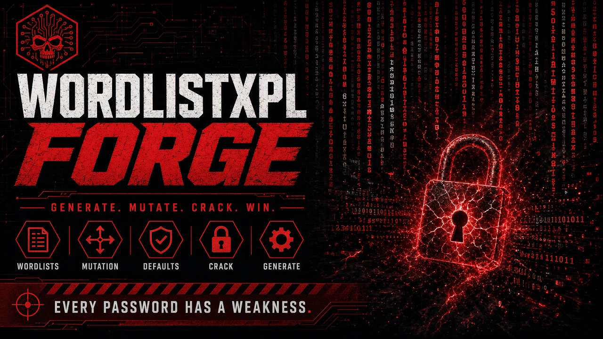

<p align="center">
  
</p>


[](README.md#compatibility)
[](LICENSE)
[](https://github.com/mrhenrike)
[](https://github.com/mrhenrike/WordlistXPL-Forge/issues)
[](https://github.com/mrhenrike/WordlistXPL-Forge/commits)

---

> **Platform Note:** This framework is designed and tested primarily on **Linux** (Debian/Ubuntu/Kali). Most hardware-dependent modules (wireless adapters, USB devices, raw socket access, firmware tools) require Linux. Running on Windows or macOS may cause errors or limited functionality in many modules. Linux is strongly recommended for maximum compatibility.

---

# WordlistXPL-Forge

**Unified wordlist generation toolkit for pentest and red team operations: 59 subcommands in a single CLI.** Official member of the **XPL-Forge** suite. Charset/mask generation, personal and corporate target profiling, web scraping (JS/CSS/PDF extraction), OCR, document parsing (PDF/XLSX/DOCX), leet speak permutations, XOR crypto, DNS/subdomain fuzzing, phone number generation, corporate user enumeration, retail/pharmacy credential patterns, default credential databases (IoT/ICS/SCADA/PLC/HMI), ISP WiFi keyspace generation, password-DNA behavioral analysis, keyword combiner, word mangling, merge and sanitize, ML-based ranking with SecLists corpus training, statistical analysis, PCFG probabilistic grammar generation, OMEN-style Markov chain generation, keyboard walk generation, automatic hashcat rule generation, PRINCE combinatorial chaining, wordlist quality benchmarking, phrase-initials acrostic generation, existing-password mutation engine, digit-to-text variants (EN/PT/BR/ES), OSINT permutation, CUPP-style profiling, MAYA ranking, anomaly scoring, global length filters, and disk-space safety checks. It also runs and converts hashcat/John rules, performs high-performance list operations (dedup, subtract, split, keyspace), optional neural generation (FLA/PassGPT style), zxcvbn-style strength scoring with HIBP, hash identification and generation, hcmask export, advanced OSINT (Wayback/GitHub org), diceware passphrases, and MAYA-style engine evaluation and curation.

CLI: `wlf` / `python wlf.py`.

Author: André Henrique (`mrhenrike`) | União Geek | https://uniaogeek.com.br/

> **Full documentation:** [docs/COMMAND-COVERAGE.md](docs/COMMAND-COVERAGE.md) (every subcommand, flag, input and output) · [Wiki](https://github.com/mrhenrike/WordlistXPL-Forge/wiki)

---

> **DISCLAIMER:** This tool is intended **exclusively for authorized security testing, penetration testing, lab work, and education**. Unauthorized use against systems you do not own or have explicit written permission to test is **illegal** and unethical. The author assumes no liability for misuse of the code or of any function in this toolkit.

The generator emits **many** password and username patterns (names, dates, brands, leet, years, keyboard walks, grammar models, and similar). If you, your company, or a user build secrets from **public information**, predictable patterns, or personal data (name, team, pet, date, brand, domain), the chance that this tool emits a wordlist containing a **real** password or username is **extremely high, almost certain**.

That is not a leak and does not prove a prior breach. It is weak or predictable secret choice. Use a password manager and MFA.

This public tree ships the **same generator**. It does **not** distribute a Brazilian password corpus (`wlist_brasil`) and it does **not** ship operator-supplied corporate OSINT wordlists. It does ship vendor factory default credentials, username samples, lab lists, and discovery paths. Pass `--vars`, `--domain`, `--brand`, `--name` (and similar flags) with **your** authorized-engagement data.

---

## Quick Start

### Install via pip

```bash
pip install wordlistxpl-forge              # core
pip install wordlistxpl-forge[full]        # all extras (OCR, docs, scrape)
pip install wordlistxpl-forge[ocr]         # OCR only (needs extra system libs)
pip install wordlistxpl-forge[docs]        # PDF/XLSX/DOCX extract
pip install wordlistxpl-forge[scrape]      # extra scrape parsers
```

```bash
wlf --help                 # 44 subcommands
pip show wordlistxpl-forge
```

### Clone from source

```bash
git clone https://github.com/mrhenrike/WordlistXPL-Forge.git
cd WordlistXPL-Forge

pip install -r requirements.txt pyyaml

# Linux / macOS / Termux (optional venv)
chmod +x setup_venv.sh && ./setup_venv.sh && source .venv/bin/activate

# Windows PowerShell
.\setup_venv.ps1; .\.venv\Scripts\Activate.ps1
```

### Run

```bash
python wlf.py              # interactive menu
python wlf.py --help       # full CLI help (44 subcommands)
wlf --help                 # after pip install
```

Packaging metadata stays local (`pyproject.toml` is not in git). Prefer `pip install wordlistxpl-forge` or run `python wlf.py` from this tree.

Per-command pages: [docs/commands/](docs/commands/) (en-US) and [docs/pt-BR/commands/](docs/pt-BR/commands/).

---

## Subcommands

| # | Command | Description |
|---|---------|-------------|
| 1 | `charset` | Charset/mask generation (crunch-style + hashcat masks) |
| 2 | `pattern` | Template-based generation with variables |
| 3 | `profile` | Personal target profiling (CUPP-style wizard) |
| 4 | `corp` | Corporate target profiling |
| 5 | `corp-users` | Corporate domain user/password generation (50+ patterns) |
| 6 | `phone` | Phone number wordlists (BR, US, UK) |
| 7 | `scrape` | Web scraping (CeWL/CeWLeR-style) with JS/CSS/PDF extraction |
| 8 | `ocr` | OCR text extraction from images |
| 9 | `extract` | Extract words from PDF/XLSX/DOCX |
| 10 | `mutate` | Existing-password mutation engine (case / leet / prefix / suffix) |
| 11 | `num2text` | Digit-to-text variants (EN/PT/BR/ES) |
| 12 | `phrase` | Phrase-initials acrostic generator (`@0x90` / hacker-suffix style) |
| 13 | `leet` | Leet speak permutations |
| 14 | `leet-perm` | Cartesian leet permutation over a wordlist (elpscrk-style) |
| 15 | `xor` | XOR encrypt/decrypt/brute-force |
| 16 | `analyze` | Statistical analysis (pipal-style) |
| 17 | `merge` | Merge and deduplicate wordlists |
| 18 | `dns` | DNS/subdomain fuzzing (alterx-style) |
| 19 | `pharma` | Retail/pharmacy chain credential patterns (brand+id, system+taxid) |
| 20 | `sanitize` | Clean and normalize wordlists |
| 21 | `reverse` | Reverse line order |
| 22 | `mangle` | Word mangling rules |
| 23 | `improve` | Enrich an existing wordlist with leet, years, and specials |
| 24 | `maya-rank` | Rank candidates by MAYA cracking probability |
| 25 | `osint-perm` | OSINT-based password permutations from a target profile |
| 26 | `cupp` | CUPP-style target-specific password generation |
| 27 | `pattern-rank` | Keyboard walks, PT-BR months, Hashcat masks |
| 28 | `scrape-target` | Lightweight crawl of a URL for word extraction |
| 29 | `default-creds` | Query default credentials database (IoT/routers/printers/ICS) |
| 30 | `isp-keygen` | ISP default WiFi password keyspace generator |
| 31 | `sysinfo` | Hardware and compute info |
| 32 | `corp-prefixes` | Corporate prefix usernames (MSP/SOC/DevOps) |
| 33 | `train` | Train ML pattern model (local + SecLists corpus) |
| 34 | `password-dna` | Analyze password patterns and generate behavioral variants |
| 35 | `combiner` | Keyword combiner (intelligence-wordlist-generator style) |
| 36 | `pcfg` | PCFG probabilistic grammar: train and generate (Weir et al.) |
| 37 | `markov` | OMEN-style positional Markov chain generator |
| 38 | `kwalk` | Keyboard walk password generator (kwprocessor-style) |
| 39 | `rulegen` | Auto-generate hashcat `.rule` files from password analysis |
| 40 | `benchmark` | Wordlist quality benchmarking (MAYA-inspired metrics) |
| 41 | `anomaly-score` | Rank entries by anomaly score (most unusual first) |
| 42 | `prince` | PRINCE attack: chained element combination |
| 43 | `br-names` | Brazilian name-based username generator (optional local name lists) |
| 44 | `iwlgen` | Intelligence keyword permutation generator |
| 45 | `rules` | Apply, convert or optimize hashcat/John rules (`--stdout -r` equivalent) |
| 46 | `dedup` | Order-preserving deduplication (optional Bloom filter) |
| 47 | `subtract` | Remove entries present in other files (rli-style) |
| 48 | `split` | Split by count, size or entry length (splitlen-style) |
| 49 | `keyspace` | Estimate candidate count and time to exhaust |
| 50 | `neural` | Neural char-level generation, guided sampling and DPG (optional `[neural]`) |
| 51 | `strength` | zxcvbn-style strength and entropy, crack time, optional HIBP |
| 52 | `hash-id` | Identify likely hash algorithms |
| 53 | `hash-gen` | Generate hashes for test corpora (md5/sha/ntlm/bcrypt/argon2/...) |
| 54 | `hcmask` | Export a hashcat `.hcmask` from a wordlist |
| 55 | `osint` | Advanced OSINT (Wayback, GitHub org, NER, optional LLM enrichment) |
| 56 | `passphrase` | Diceware/mnemonic passphrase generation (CSPRNG) |
| 57 | `evaluate` | Compare engines by guess-number and coverage (MAYA-style) |
| 58 | `curate` | Rank lists by crack rate and merge the best (weakpass-style) |
| 59 | `affix` | Composite-affix mutation layer: chain date + special affixes; emit hashcat ruleset |

Nested modes (also documented): `pcfg train`, `pcfg generate`, `markov train`, `markov generate`, `neural train`, `neural generate`.

> **Detailed syntax and examples for each subcommand:** [docs/COMMAND-COVERAGE.md](docs/COMMAND-COVERAGE.md) · [Wiki](https://github.com/mrhenrike/WordlistXPL-Forge/wiki)

### Global Flags

Global flags go **before** the subcommand.

```bash
python wlf.py --threads 20 --compute cuda --no-ml --min-len 8 --max-len 20 --limit 100000 charset 8 12
```

| Flag | Default | Description |
|------|---------|-------------|
| `--threads N` | `5` | Thread count (1-300) |
| `--compute MODE` | `auto` | `auto` / `cpu` / `gpu` / `cuda` / `rocm` / `mps` / `hybrid` |
| `--no-ml` | off | Disable ML ranking |
| `--limit N` | `0` | Stop after N entries (`0` = unlimited) |
| `--timeout SECS` | `0` | Stop after SECS (`0` = unlimited) |
| `--min-len N` | `0` | Global minimum word length filter |
| `--max-len N` | `0` | Global maximum word length filter |
| `--lang LOCALE` | `en` | `en` / `pt-br` / `pt-pt` / `es` (months, zodiac, wizard) |
| `-v` | off | Verbose logging |

`--limit` is global. Example: `wlf --limit 5 charset 3 3 ab`.

---

## Common Usage Examples

Examples use placeholders (`acme`, `xpto`, `brandx`, `corpx`, `pessoax`, `personay`, `robotx`). Replace them with data from **your** authorized engagement.

### Corporate pentest: generate users + passwords

```bash
python wlf.py corp-users --domain acme.example --file employees.txt --passwords --combo -o acme_combo.lst
```

### Personal target profiling

```bash
python wlf.py profile --name "PessoaX" --nick robotx --birth 15/03/1990 --leet aggressive -o target.lst
python wlf.py cupp --first-name PessoaX --last-name PersonY --company BrandX -o cupp.lst
python wlf.py osint-perm --first-name PessoaX --last-name PersonY --nick robotx --birth 01/1990 --complexity 2 -o osint.lst
```

### Charset with hashcat mask

```bash
python wlf.py charset 8 8 --mask "?u?l?l?l?d?d?d?s" -o passwords.lst
```

### Template-based patterns

```bash
python wlf.py pattern -t "{company}{year}!" --vars company=acme,xpto,brandx year=2020-2026 -o patterns.lst
```

### DNS subdomain fuzzing

```bash
python wlf.py dns -d acme.example --words dev staging api admin portal -o subdomains.lst
```

### Analyze an existing wordlist

```bash
python wlf.py analyze passwords.lst --top 30 --masks --format json -o analysis.json
```

### Default credentials lookup

```bash
python wlf.py default-creds --list-vendors
python wlf.py default-creds --vendor mikrotik --format combo -o mikrotik_creds.lst
python wlf.py default-creds --protocol snmp --format user -o snmp_users.lst
```

### ISP WiFi keyspace generation

```bash
python wlf.py isp-keygen --list
python wlf.py isp-keygen --isp xfinity_comcast --estimate
python wlf.py isp-keygen --isp xfinity_comcast --limit 100000 -o xfinity.lst
```

### Web scraping with JS/CSS/PDF

```bash
python wlf.py scrape https://acme.example --include-js --include-css --include-pdf --lowercase -o words.lst
python wlf.py scrape https://acme.example --emails --output-emails emails.txt --output-urls urls.txt
python wlf.py scrape-target --url https://acme.example --depth 2 --max-pages 20 -o crawl.lst
```

### Merge, sanitize, improve

```bash
python wlf.py merge list1.lst list2.lst --min-len 6 --sort -o merged.lst
python wlf.py sanitize merged.lst --inplace
python wlf.py improve merged.lst --leet aggressive --year-start 2020 --year-end 2027 -o improved.lst
python wlf.py leet-perm words.lst --max-per-word 256 -o leet_words.lst
```

### Keyword permutation

```bash
python wlf.py combiner --keywords admin,router,brandx -o combo.lst
python wlf.py iwlgen --keywords admin,router,2026 --connectors @. --leet -o iwl.lst
```

### Targeted cracking workflow (combiner + affix + rules)

Chain per-component CamelCase and linguistic connectors (combiner) with composite
date/special affixes (affix), then let hashcat apply the affix rule set on the GPU
so the large expansion never has to be written to disk. The consolidated helper
scripts run the whole flow in one command:

```bash
# Linux/macOS
./scripts/targeted-crack.sh --keywords alpha,bravo,charlie --dates '0724,1988' \
    --hashfile hashes.txt --hashmode 1000 --run
```

```powershell
# Windows
./scripts/targeted-crack.ps1 -Keywords alpha,bravo,charlie -Dates '0724,1988' `
    -HashFile hashes.txt -HashMode 1000 -Run
```

Without `--run` (or `-Run`) the scripts build `generated/targeted_bases.lst` and
`generated/targeted_affix.rule` and print the ready hashcat command. The
equivalent manual steps are:

```bash
python wlf.py combiner alpha bravo charlie --titlecase --link-lang pt --assume-yes \
    --connectors 'EMPTY,_,.,na,no,da' -o bases.lst
python wlf.py affix bases.lst --dates '0724,1988' --specials '!,@,#' --emit-ruleset affix.rule
hashcat -a 0 -m 1000 hashes.txt bases.lst -r affix.rule
```


> **Coverage matrix and per-flag pages:** [docs/COMMAND-COVERAGE.md](docs/COMMAND-COVERAGE.md)

---

## Password DNA

Analyze password patterns and generate behavioral variants. The `password-dna` subcommand extracts structural "DNA" from known passwords (uppercase, lowercase, digit, symbol positions) and produces new candidates that follow the same behavioral patterns.

```bash
python wlf.py password-dna --input known_passwords.lst --depth 2 -o dna_variants.lst
python wlf.py password-dna --seed "BrandX2024!" --depth 3 --leet -o seed_variants.lst
python wlf.py password-dna --input known_passwords.lst --analyze-only --format json -o dna_report.json
```

---

## PCFG Grammar Engine

Train a Probabilistic Context-Free Grammar from a password corpus and generate candidates in **probability order** (most likely first). Based on Weir et al. (IEEE S&P 2009).

```bash
python wlf.py pcfg train --wordlist rockyou.txt
python wlf.py pcfg generate -o candidates.lst --limit 1000000
python wlf.py pcfg generate --top-structures 50 --top-terminals 100 --min-len 8
```

## Markov Chain Generator

OMEN-style positional Markov chain generator. Learns per-position character transitions and generates in ascending cost order (most probable first).

```bash
python wlf.py markov train --wordlist leaked.txt --order 3
python wlf.py markov generate --min-len 6 --max-len 12 --max-cost 30 --limit 500000
```

## Keyboard Walk Generator

Generate passwords based on physical keyboard adjacency walks. Supports QWERTY, AZERTY, QWERTZ, Dvorak, and numpad layouts.

```bash
python wlf.py kwalk --min-len 4 --max-len 10 -o walks.lst
python wlf.py kwalk --layout qwerty,numpad --no-shift --max-changes 2
python wlf.py kwalk --list-layouts
```

## Hashcat Rule Auto-Generation

Analyze real passwords and automatically generate hashcat-compatible `.rule` files by reverse-engineering transformation patterns.

```bash
python wlf.py rulegen --wordlist leaked.txt -o rules.rule --top-rules 200
python wlf.py rulegen --wordlist passwords.lst --dictionary english.txt -o optimized.rule
```

## PRINCE Attack Mode

PRINCE (PRobability INfinite Chained Elements) generates passwords by combining multiple words from a wordlist. Discovers multi-word passwords like `correcthorsebatterystaple`.

```bash
python wlf.py prince --wordlist top1000.txt --min-elem 2 --max-elem 4 -o prince.lst
python wlf.py prince --wordlist words.txt --separator "-" --case-permute --min-len 8
```

## Wordlist Quality Benchmark

Measure the effectiveness of a generated wordlist against a reference set. Reports hit rate, efficiency, diversity, coverage by length/charset, and estimated crack times.

```bash
python wlf.py benchmark --wordlist generated.lst --reference rockyou_sample.txt
python wlf.py benchmark --wordlist output.lst --reference test_set.txt --json report.json
python wlf.py maya-rank generated.lst --top 1000 -o ranked.lst
python wlf.py anomaly-score labs/labs_passwords.lst --top 50
python wlf.py pattern-rank passwords.lst --layout qwerty
```

---

## Rule Engine

Run hashcat and John the Ripper rules against a wordlist (the equivalent of `hashcat --stdout -r`), convert between the two dialects, and optimize rule files.

```bash
python wlf.py rules apply --wordlist base.txt --rules best64.rule -o out.lst
python wlf.py rules apply --wordlist base.txt --rule "c $1;so0;u" --dedupe
python wlf.py rules convert --rules hc.rule --to john -o jtr.rule
python wlf.py rules optimize --rules messy.rule -o clean.rule
```

## High-Performance List Operations

Streaming utilities for very large lists: order-preserving deduplication (optional Bloom filter), set subtraction, splitting, and keyspace estimation.

```bash
python wlf.py dedup huge.txt --bloom --capacity 50000000 -o unique.txt
python wlf.py subtract candidates.txt --remove cracked.txt -o todo.txt
python wlf.py split big.txt --lines 1000000 -o part
python wlf.py split words.txt --by-length -o bylen
python wlf.py keyspace --mask "?u?l?l?l?d?d?d?d" --pps 5e9
```

## Neural Generation (optional `[neural]` extra)

Character-level neural generation in the FLA and PassGPT tradition. Requires `pip install wordlistxpl-forge[neural]` (torch, plus transformers for PassGPT adapters). The core keeps working with `pcfg` and `markov` without this extra.

```bash
python wlf.py neural train --wordlist rockyou.txt --epochs 5
python wlf.py --limit 100000 neural generate --temperature 0.9 -o out.lst
python wlf.py --limit 5000 neural generate --prefix admin --mask "?u?l?l?l?d?d"
python wlf.py --limit 100000 neural generate --adapt cracked.txt   # Dynamic Password Guessing
python wlf.py --limit 5000 neural generate --adapter passgpt --model javirandor/passgpt-10characters
```

## Password Strength and Entropy

zxcvbn-style scoring with pattern detection (dictionary, l33t, sequences, repeats, keyboard, dates), entropy, crack time per scenario and per hash, and optional HIBP check via k-anonymity.

```bash
python wlf.py strength "Summer2024!"
python wlf.py strength "P@ssw0rd" --hibp
python wlf.py strength --wordlist candidates.txt -o scored.tsv
```

## Hashing and Cracking Interop

Identify hashes, generate digests for test corpora, and export hashcat masks.

```bash
python wlf.py hash-id 5f4dcc3b5aa765d61d8327deb882cf99
python wlf.py hash-gen --wordlist pw.txt --algo ntlm --format hash:plain -o ntlm.txt
python wlf.py hash-gen --wordlist pw.txt --algo bcrypt --format plain:hash
python wlf.py hcmask --wordlist leaked.txt --top 50 -o masks.hcmask
```

## Advanced OSINT and Passphrases

Build contextual wordlists from passive OSINT (Wayback Machine, GitHub organizations) with lightweight NER and optional LLM enrichment, and generate diceware passphrases with a secure random source.

```bash
python wlf.py osint --wayback example.com --github-org acme --enrich -o rich.lst
python wlf.py osint --github-org acme --lowercase -o org.lst
python wlf.py passphrase --words 5 --separator . --capitalize --number
python wlf.py passphrase --wordlist eff_large_wordlist.txt --words 6 --symbol
```

## Engine Evaluation and Curation

Compare engines by guess-number and coverage against a test split (MAYA-style), and rank candidate lists by crack rate to merge the best (weakpass-style).

```bash
python wlf.py evaluate --candidates pcfg.lst markov.lst --labels pcfg,markov --reference test.txt
python wlf.py curate --candidates a.txt b.txt c.txt --reference test.txt --top-k 2 -o best.txt
```

See the full competitive analysis and feature parity in [docs/COMPETITIVE-ANALYSIS.md](docs/COMPETITIVE-ANALYSIS.md).

---

## Default Credentials Database

Query the built-in database of **1,506** factory-default credentials covering **88 vendors** (plus SNMP communities): routers, switches, printers, IP cameras, ICS/SCADA (PLCs, HMIs, RTUs), IoT gateways, and more.

```bash
python wlf.py default-creds --list-vendors
python wlf.py default-creds --vendor siemens --format combo -o siemens_creds.lst
python wlf.py default-creds --protocol modbus --format user -o modbus_users.lst
python wlf.py default-creds --category ics --format combo -o ics_defaults.lst
python wlf.py default-creds --export-all --format json -o all_defaults.json
```

---

## Phrase, mutate, retail patterns, digit-to-text

### Phrase-initials

```bash
python wlf.py phrase "my secret corporate phrase" -o phrase.lst
python wlf.py phrase "my secret corporate phrase" --prefixes _,__ --suffixes @0x90,#0x90 -o phrase.lst
```

### Existing password mutation

```bash
python wlf.py mutate "Summer2024" -o mutated.lst
python wlf.py mutate "password123" --leet-mode aggressive --min-len 10 --max-len 25 -o mutated.lst
```

### Retail / pharmacy chain patterns

`--brand` and `--ids` come from **your** engagement. Examples below are placeholders.

```bash
python wlf.py pharma --brand BrandX --ids 1200-1210 -o pharma.lst
python wlf.py pharma --brand CorpX --abbrevs CX,COR --cnpj 00000000000000 --mode passwords
python wlf.py pharma --brand BrandX --ids 1000-2000 --domains acme.example --mode usernames
```

### Digit-to-text

Converts numbers (up to 12 digits) into text with case/leet/separator variants. Supports EN, PT, BR (feminine forms), and ES.

```bash
python wlf.py num2text --number 123
python wlf.py num2text --number 12 --lang br
python wlf.py num2text --number 123 --lang es
python wlf.py num2text --range 0-9999 --lang en -o number_words.lst
python wlf.py num2text --range 2000-2030 --lang pt -o years_pt.lst
```

| Code | Also accepts | Language |
|------|-------------|----------|
| `en` | `en-us`, `en-gb` | English (default) |
| `pt` | `pt-pt` | European Portuguese |
| `br` | `pt-br` | Brazilian Portuguese |
| `es` | `es-es`, `es-mx`, `es-la` | Spanish |

### Global length filters

```bash
python wlf.py --min-len 8 --max-len 20 charset 8 12 -o filtered.lst
python wlf.py --min-len 10 mutate "admin" -o long_variants.lst
```

---

## What this tree ships

| File | Description | Entries |
|------|-------------|---------|
| `data/default_credentials.json` | Structured default credentials (1,506 entries, 88 vendors, SNMP) | n/a |
| `passwords/default-creds-combo.lst` | Default credential `user:password` combos (routers, printers, ICS/SCADA) | ~3.1K |
| `usernames/username_br.lst` | Brazilian and global username patterns | ~1.7K |
| `fuzzing/discovery_br.lst` | Brazilian web discovery and API fuzzing paths | ~900 |
| `labs/*.lst` | Workshop and training wordlists | small |
| `data/behavior_patterns.json` | Structural generation patterns (not a company list) | n/a |
| `data/corp_prefix_patterns.json` | Generic corporate username prefix templates | n/a |

**Not in this tree:** `passwords/wlist_brasil.lst` (Brazilian password corpus) and any operator-supplied corporate OSINT lists. The CLI still **generates** those pattern families from the flags you pass.

`br-names` can load an optional local BRWordList directory if you provide `--brwordlist-path`. That corpus is not bundled here.

---

## Is a password in these lists?

This repository does not ship `wlist_brasil`. You can still check shipped defaults, lab samples, or **your** generated output:

```bash
# Linux/macOS: shipped factory defaults
grep -qxF 'admin:admin' passwords/default-creds-combo.lst && echo "FOUND" || echo "Not found"

# Your generated list
grep -qxF 'YourPassword' generated/output.lst && echo "FOUND" || echo "Not found"

# Windows PowerShell
Select-String -Path passwords\default-creds-combo.lst -Pattern '^admin:admin$' -SimpleMatch -Quiet
```

If a **real** secret matches a generated candidate, change it, enable MFA, and use a password manager. That hit is predictable construction, not a dump from this repo.

---

## ML Model

A lightweight ML model ranks generated candidates by structural pattern probability. Train it with local data or the SecLists corpus:

```bash
python wlf.py train --auto
python wlf.py train --seclists
python wlf.py train --auto --seclists
python wlf.py train --seclists /path/to/SecLists --seclists-categories password frequency
```

The model stores **only structural patterns**: no PII, passwords, or company names.

---

## Credits and inspiration

| Project | Inspiration |
|---------|-------------|
| [CUPP](https://github.com/Mebus/cupp) | Personal target profiling |
| [Crunch](https://github.com/jim3ma/crunch) | Charset-based generation |
| [CeWL](https://github.com/digininja/CeWL) | Web scraping for wordlists |
| [CeWLeR](https://github.com/roys/cewler) | Modern Python web scraping (JS/CSS/PDF) |
| [routersploit](https://github.com/threat9/routersploit) | Default credentials for IoT/routers |
| [alterx](https://github.com/projectdiscovery/alterx) | DNS/subdomain fuzzing |
| [pipal](https://github.com/digininja/pipal) | Statistical analysis |
| [SecLists](https://github.com/danielmiessler/SecLists) | Curated security lists |
| [elpscrk](https://github.com/D4Vinci/elpscrk) | Permutation-based generation |
| [BEWGor](https://github.com/berzerk0/BEWGor) | Biographical wordlist generator |
| [pnwgen](https://github.com/toxydose/pnwgen) | Phone number generation |
| [intelligence-wordlist-generator](https://github.com/MichaelDim02/intelligence-wordlist-generator) | Keyword combiner |
| [SCaDAPass](https://github.com/scadastrangelove/SCaDAPass) | ICS/SCADA default credentials |
| [pcfg_cracker](https://github.com/lakiw/pcfg_cracker) | PCFG probabilistic grammar (Weir et al.) |
| [OMEN](https://github.com/RUB-SysSec/OMEN) | Ordered Markov ENumerator |
| [kwprocessor](https://github.com/hashcat/kwprocessor) | Keyboard walk generation |
| [PACK](https://github.com/iphelix/pack) | Password Analysis and Cracking Kit (rulegen) |
| [princeprocessor](https://github.com/hashcat/princeprocessor) | PRINCE attack mode |
| [MAYA](https://github.com/williamcorrias/MAYA-Password-Benchmarking) | Wordlist quality benchmarking framework |
| [hashcat](https://github.com/hashcat/hashcat) | Rule engine syntax and mask tokens |
| [hashcat-utils](https://github.com/hashcat/hashcat-utils) | List operations (splitlen, rli, rules_optimize) |
| [rling](https://github.com/Cynosureprime/rling) / [duplicut](https://github.com/nil0x42/duplicut) | High-performance dedup and subtraction |
| [John the Ripper](https://github.com/openwall/john) | Rule dialect for conversion |
| [zxcvbn](https://github.com/dropbox/zxcvbn) / [zxcvbn-ts](https://github.com/zxcvbn-ts/zxcvbn) | Strength and entropy estimation |
| [Have I Been Pwned](https://haveibeenpwned.com/Passwords) | k-anonymity breach check |
| [PassGPT](https://github.com/javirandor/passgpt) | Transformer password modeling (adapter) |
| [FLA](https://github.com/cupslab/neural_network_cracking) | Neural (LSTM) password guessing |
| [name-that-hash](https://github.com/HashPals/Name-That-Hash) | Hash identification |
| [CeWLeR / cewlai](https://github.com/chocapikk/cewlai) | AI-assisted OSINT wordlists |
| [WordForge](https://pypi.org/project/wordforge/) | OSINT collectors (Wayback, GitHub org, NER) |
| [EFF Diceware](https://www.eff.org/dice) | Passphrase generation |
| [weakpass](https://weakpass.com/) | Crack-rate ranking and curation |
---

## Contact

**Support / general inquiries:** security.research@uniaogeek.com.br
**Security issues:** [SECURITY.md](SECURITY.md)

---

### André Henrique

| | |
|---|---|
| GitHub | [@mrhenrike](https://github.com/mrhenrike) |
| X / Twitter | [@mrhenrike](https://x.com/mrhenrike) |
| LinkedIn | [mrhenrike](https://www.linkedin.com/in/mrhenrike/) |

### União Geek

| | |
|---|---|
| Website | [uniaogeek.com.br](https://uniaogeek.com.br/) |
| Blog | [uniaogeek.com.br/blog](https://uniaogeek.com.br/blog/) |
| GitHub | [Uniao-Geek](https://github.com/Uniao-Geek) |
| Instagram | [@uniaogeek](https://www.instagram.com/uniaogeek/) |

---

**License:** BSD-3-Clause License - Copyright (c) 2026 União Geek
**Created by:** André Henrique ([@mrhenrike](https://github.com/mrhenrike)) | [União Geek](https://uniaogeek.com.br/)

[Leia em Português](README.pt-BR.md) - [Command coverage](docs/commands.md) - [Wiki](../../wiki)