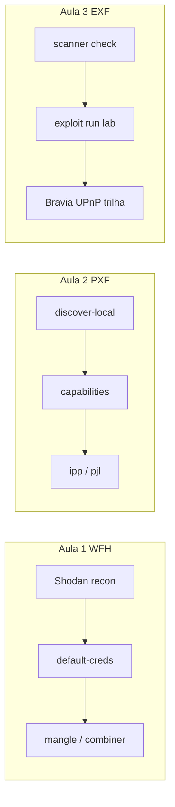

# Treinamento IoT — XPL Forge Suite

Material de laboratorio derivado da auditoria de codigo (Fase 2, 2026-06-22).
Cada exercicio usa blocos **IN** (comando) e **OUT** (saida esperada) para montagem de slides.

## Aviso legal

- Use **somente** em alvos proprios, laboratorio ISH/SafeLabs ou com autorizacao escrita.
- Shodan/Censys/FOFA: reconhecimento passivo; exploracao apenas no escopo autorizado.
- Nao inclua credenciais reais de clientes nos exemplos de aula.

## Pre-requisitos

| Item | Path / comando |
|------|----------------|
| Superprojeto | `C:\Projetos-SafeLabs` (Linux: `/mnt/predator/Projetos-SafeLabs`) |
| Submodulos (full depth) | `submodules/Uniao-Geek/{WordListsForHacking,PrinterXPL-Forge,EmbedXPL-Forge}` |
| Init script (este PC) | `tools/submodules/init-pc-ug-full.ps1` |
| Python | 3.8+ (3.11 testado); EmbedXPL recomenda 3.8+ |
| Shodan (opcional) | `SHODAN_API_KEY` para discovery online no PrinterXPL |

### Setup rapido (PowerShell)

**IN**
```powershell
cd C:\Projetos-SafeLabs
.\tools\submodules\init-pc-ug-full.ps1
pip install -r submodules\Uniao-Geek\WordListsForHacking\requirements.txt
```

**OUT**
```
OK HEAD=372f86eb commits=72
OK HEAD=25e95c1b commits=268
OK HEAD=10987034 commits=228
Done. Next: Fase 2 auditoria em .tmp/iot-xpl-audit/
```

## Indice dos modulos

| # | Arquivo | Ferramenta | Foco |
|---|---------|------------|------|
| 01 | [01-wordlists-for-hacking-lab.md](01-wordlists-for-hacking-lab.md) | WordListsForHacking (WFH) | Wordlists para credenciais IoT |
| 02 | [02-printerxpl-forge-lab.md](02-printerxpl-forge-lab.md) | PrinterXPL-Forge (PXF) | Impressoras IPP/JetDirect |
| 03 | [03-embedxpl-forge-lab.md](03-embedxpl-forge-lab.md) | EmbedXPL-Forge (EXF) | CCTV, roteadores, Smart TV |
| 05 | [05-wfh-daryus-pattern-fill.md](05-wfh-daryus-pattern-fill.md) | WFH padroes Daryus | 3 wordlists + interactive/CLI/YAML |
| 06 | [WFH-GUIA-MELISSA-ANDRADE.md](WFH-GUIA-MELISSA-ANDRADE.md) | WFH guia completo | Perfil Melissa + pipeline 3/3 alvos (v2.7.0) |

## Panorama IoT mais atacado (2023-2026)

| Tier | Categoria | Por que | Ferramenta no lab |
|------|-----------|---------|-------------------|
| 1 | Roteadores SOHO (TP-Link, ASUS, Zyxel, D-Link) | Maior base, patch lento, botnets (Mirai, Raptor Train) | EmbedXPL `exploits/routers/*` + WFH `default-creds` |
| 2 | IP cameras / NVR (Hikvision, Dahua, Intelbras OEM) | CVEs recorrentes, RTSP exposto | EmbedXPL `exploits/cameras/*` |
| 3 | NAS | Ransomware, credenciais default | EmbedXPL `exploits/nas/*` |
| 4 | Impressoras | IPP/9100 na internet, passback, spooler | PrinterXPL |
| 5 | Smart TV / signage | UPnP, APIs JSON, paineis comerciais | EmbedXPL `smart_tv/*` |

## Fluxo pedagogico sugerido (3 aulas)



## Referencia de auditoria

Mapas detalhados (nao versionados): `.tmp/iot-xpl-audit/`

## Criterios de sucesso (instrutor)

- [ ] Aluno executou pelo menos 3 blocos IN/OUT por ferramenta sem erro de path
- [ ] Aluno diferencia recon (Shodan/check) de exploit (run) no escopo lab
- [ ] Aluno identifica gap Sony Signage vs Bravia UPnP content injection
